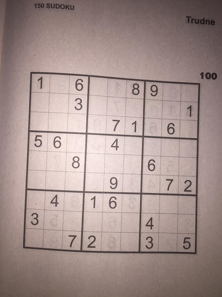
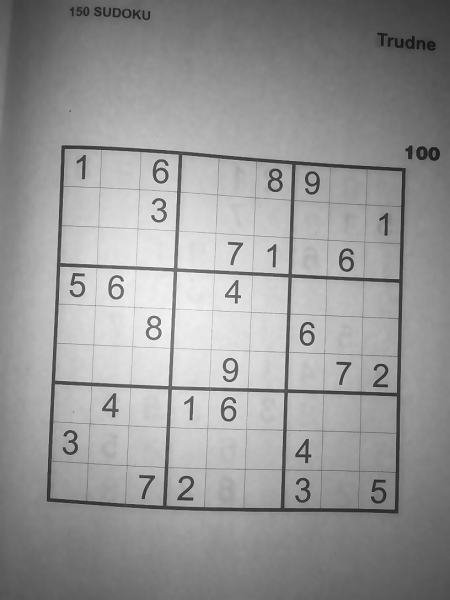
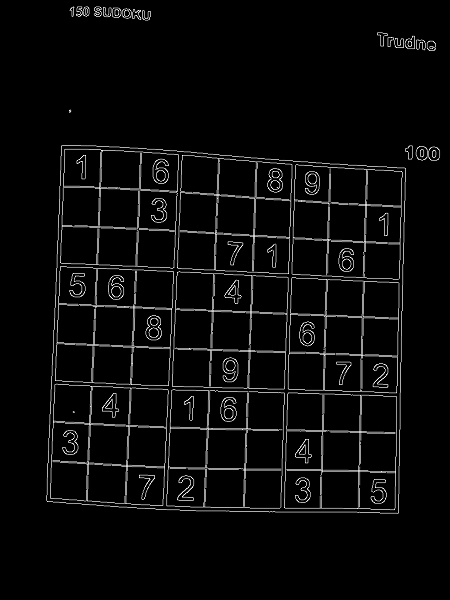

## Introduction


## Technologies

* Python 3.x
* OpenCV
* Tensorflow (w/ Keras)

## Requirements

Python 3.5-3.8 (Tensorflow doesn't support Python 3.9 for now) 

## Setup

To install required dependencies, run command:
```
pip install -r requirements.txt
```

## Usage

After installing the dependecies, simply get yourself a sudoku, run 
```
python sudoku_video.py
```
and have fun. The program will use your default system webcam. In order to be recognized, the puzzle must be quite close to the camera (it should take about 1/4 of the frame).

## The algorithm

This is an example image, to show how the image is being processed:




The first task is finding the edges of the sudoku board. The image is converted to grayscale, and then, couple of filters are being applied:

* bilateral filter smoothens the white spaces:




* Canny filter enables to detect edges:




Then, the findContours function is used, and the contour with the largest area is set to be searched board:

readme_imgs/roi.png

warpPerspective function allows us to get to transform the image so that it is not distorted, it looks as if we were looking at it straight from the above:

[warped]

In order to get rid of the grid, the image is thresholded, and erode and dilate functions are used to extract vertical and horizontal lines, which are then subtracted from the image

[thresh] - [ver] - [hor] = [digits]

The image can now be divided into 9x9 grid, and on each cell, the biggest found contour is suspected to be a digit. It stops being considered a digit if:
* Its height/width ratio is too big, making the shape too wide
* Its height/width ratio is too small, making the shape too tall
* Its height is much smaller then the median of the rest of the contours (all characters in computer font should be roughly the same height, so if one stands out by a large margin, it's probably not a digit)


## Sources

