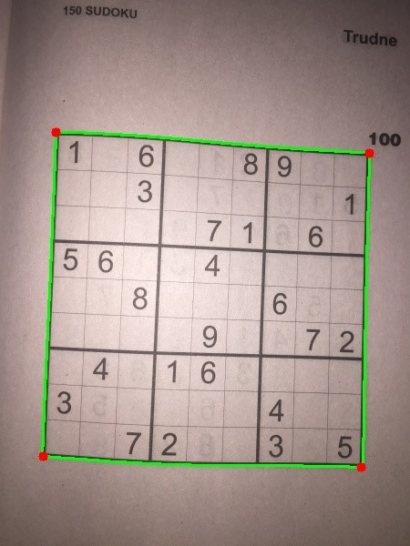
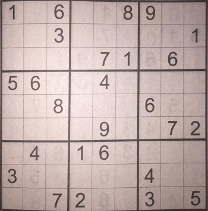
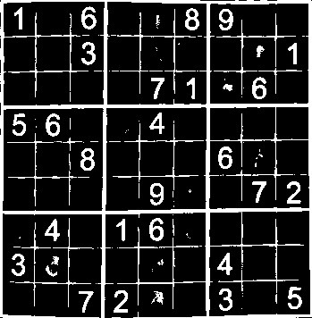
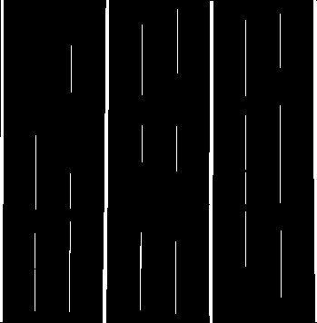
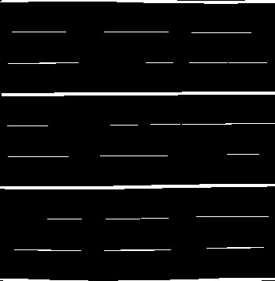
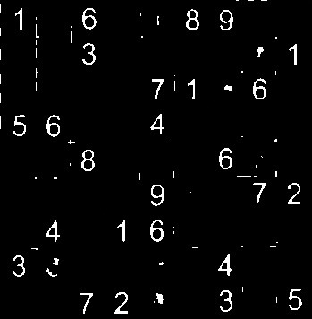
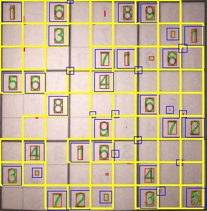
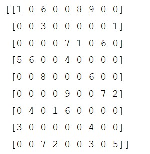

## Introduction

The idea for this project came from the desire to impress my grandma, who's a big fan of solving sudoku puzzles. It allows me to simply put the puzzle in front of my webcam, and after few seconds, the program is able to localize the board:


After that, the digits are recognized, the board is translated into NumPy array, solved, and the solution is imposed on the image in real time:


## Technologies

* Python 3.x
* OpenCV
* Tensorflow (w/ Keras)

## Requirements

Python 3.5-3.8 (Tensorflow doesn't support Python 3.9 for now) 
Webcam (or some different camera connected to the computer, serving as a webcam)

## Setup

To install required dependencies, run command:
```
pip install -r requirements.txt
```

## Usage

After installing the dependecies, simply get yourself a sudoku puzzle, run: 
```
python sudoku_video.py
```
and have fun. The program will use your default system webcam. In order to be recognized, the puzzle must be quite close to the camera (it should take about 1/4 of the frame).

## The algorithm

This is an example image, to show how the image is being processed:
  <p></p>
The first task is finding the edges of the sudoku board. The image is converted to grayscale, and then, couple of filters are being applied:

* bilateral filter smoothens the white spaces:

<p></p>

* Canny filter enables to detect edges:
 <p> </p>
   
Then, the findContours function is used, and the contour with the largest area is set to be searched board:

 <p></p>
    
warpPerspective function allows us to get to transform the image so that it is not distorted, it looks as if we were looking at it straight from the above:

 <p></p>
    
In order to get rid of the grid, the image is thresholded, and erode and dilate functions are used to extract vertical and horizontal lines, which are then subtracted from the image

<p float="left">
   <font size="10"> <b>-</b></font> 
   <font size="10"> <b>-</b></font> 
  <font size="10"> <b>=</b></font> 
   
</p>

The image can now be divided into 9x9 grid, and on each cell, the biggest found contour is suspected to be a digit.

  
  <em>Yellow squares show cells where any contour was found.</em><br>
  <em>Green shapes show found contours.</em><br>
  <em>Red rectangles show bounding boxes for found contours.</em><br>
  <em>Blue rectangles show areas suspected to be a digit.</em><br><br>

 A contour stops being considered a digit if:
* Its height/width ratio is too big, making the shape too wide
* Its height/width ratio is too small, making the shape too tall
* Its height is much smaller then the median of the rest of the contours (all characters in computer font should be roughly the same height, so if one stands out by a large margin, it's probably not a digit)

#### Digit recognition using convolutional neural network

If a contour is not filtered out, its area (marked in blue) is being fed to the simple convolutional neural network, which was trained on 3 datasets: [MNIST](http://yann.lecun.com/exdb/mnist/), [Char74k ](http://www.ee.surrey.ac.uk/CVSSP/demos/chars74k/), and [UCI Dataset](https://archive.ics.uci.edu/ml/datasets/Character+Font+Images): first one containing hand-written characters, while the other two consisted of multiple computer fonts.

In order to maintain consistence between datasets, the the Char74k UCI were resized, reorganized, and transformed accordingly. In the end, the CNN was trained on the set of 106 344 characters: 90 000 served as training samples, while the other 16 344 were testing samples. Trained model was saved to *weights/MNIST_74k_UCI.h5* file and is reused every time the script is run. 

If CNN's output for a contour is less than 0.4 it is filtered out, and considered a noice.

Knowing the location of the digits, and having them recognized, it is easy to bring the board to the form of NumPy array:

 <p></p>

#### Backtracking algorithm
The algorithm used for solving the board is pretty straightforward: it looks for the next empty cell and, if it is possible, places there a legal digit. If there are no digits that fit, the algorithm takes step backwards, and changes the previously assigned digit. The whole board is being searched this way, until the correct solution is found


## Testing

The algorithm for board recognition was tested on a set of static images, placed in *sudoku_puzzles/pretty_ones* directory. Out of 139 boards, 97 were recognized perfectly, and 27 were recognized with 2 or less mistakes. The average time of recognition was 1.4 s. The solving algorithm was succesful every time, with the average time of 2.3 seconds.

## Sources
* https://docs.opencv.org/master/dd/dd7/tutorial_morph_lines_detection.html]
* https://keras.io/examples/mnist_cnn/
* http://www.ee.surrey.ac.uk/CVSSP/demos/chars74k/
* https://hackernoon.com/sudoku-and-backtracking-6613d33229af
* https://pl.wikipedia.org/wiki/Sudoku
* https://medium.com/activating-robotic-minds/peter-norvigs-sudoku-solver-25779bb349ce
* https://www.sciencedirect.com/science/article/pii/S1571066107005142
* http://scholar.googleusercontent.com/scholar?q=cache:CQlPVMlk1gEJ:scholar.google.com/+rozwiązywanie+sudoku+artykuł&hl=pl&as_sdt=0,5&as_vis=1
* https://hackernoon.com/sudoku-solver-w-golang-opencv-3-2-3972ed3baae2
* https://docs.opencv.org/trunk/d3/dc0/group__imgproc__shape.html#gae4156f04053c44f886e387cff0ef6e08
* https://opencv-python-tutroals.readthedocs.io/en/latest/py_tutorials/py_imgproc/py_houghlines/py_houghlines.html
* https://aishack.in/tutorials/sudoku-grabber-opencv-extracting-grid/
* https://hackernoon.com/building-a-gas-pump-scanner-with-opencv-python-ios-116fe6c9ae8b
